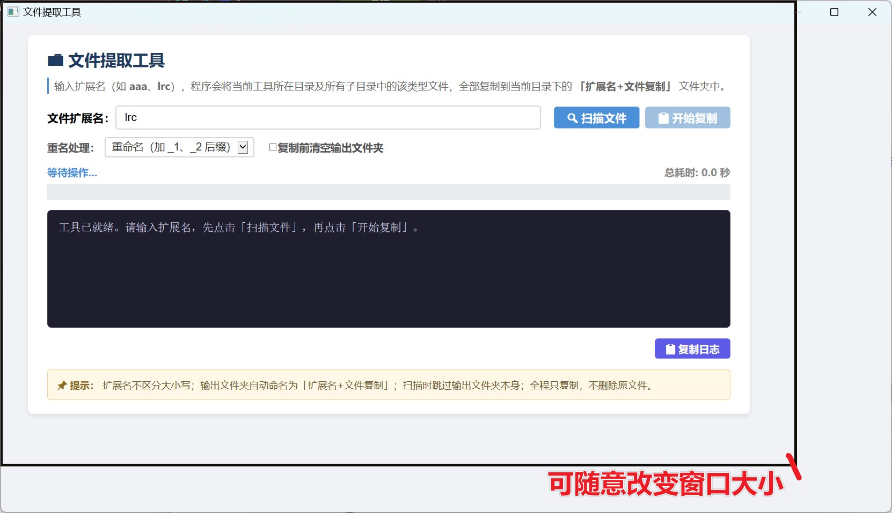
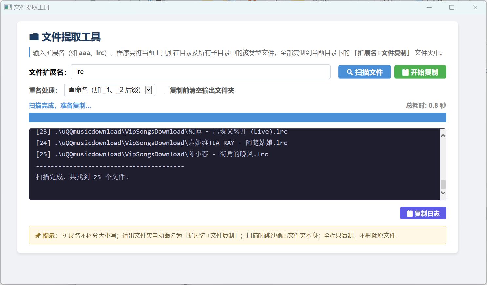
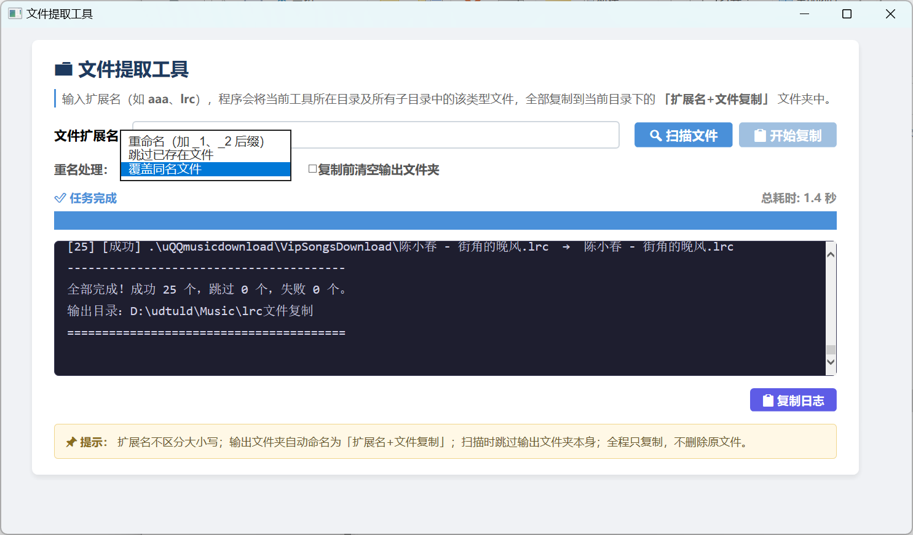
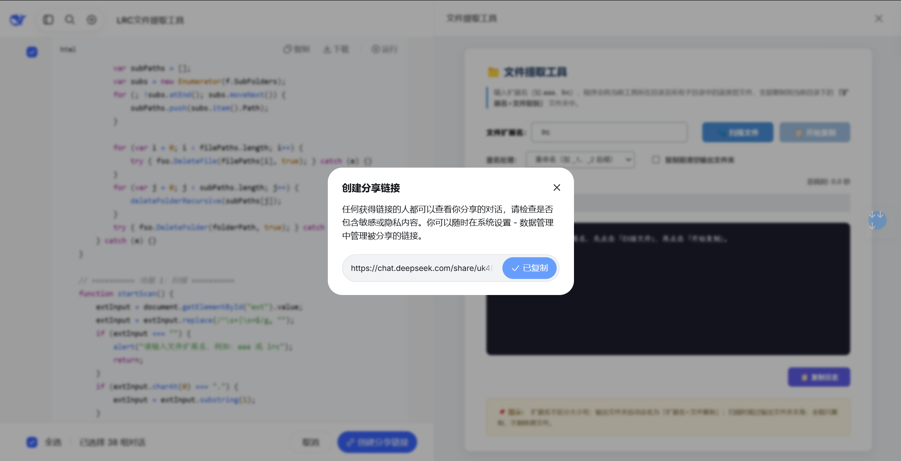

# same-file-copier-hta
一个同类型文件复制工具-基于hta的应用。

 ---







 这是我用deepseek（免费版）磨了一下午完善好的一个工具。
 本身这里工具其实用一个bat就能搞定。我一开始拿到的工具也是一个bat。但我用完之后觉得这个工具还有改进的空间--先问我要复制什么类型再开始复制。
 再后来就是现在这个样子了。界面还不错，够用了。
 工具本身很简单，新建一个文本，然后复制，保存为hat格式就可以。

---

## 使用说明

文件保存：新建文本文档 → 粘贴上方代码 → 文件菜单「另存为」→ 文件名填 文件提取工具.hta → 编码选 UTF-8 → 保存。

## 日常使用

把 .hta 文件放到你想整理的目录（比如 D:\我的音乐）。
双击运行。
输入扩展名（如 lrc 或 aaa），点「🔍 扫描文件」。
扫描完成后，点「📋 开始复制」。

## 核心特性

中文界面，不乱码，双击即用，无需安装 Python
可自定义窗口大小（鼠标拖拽边缘）
进度条 30px 直角长方形 + 总耗时统计
扫描日志显示相对路径（.\子目录\文件名）
三种重名处理：重命名 / 跳过 / 覆盖
可选「复制前清空输出文件夹」
常见错误中文提示
日志一键复制到剪贴板


## 操作系统

| 系统 | 是否支持 | 说明 |
|------|----------|------|
| Windows 11 | ✅ 支持 | 自带 `mshta.exe`，可正常运行 |
| Windows 10 | ✅ 支持 | 自带 `mshta.exe`，最常用环境 |
| Windows 8 / 8.1 | ✅ 支持 | 自带 `mshta.exe` |
| Windows 7 | ✅ 支持 | 需要 IE8 以上（一般都有） |
| Windows Server 2008 R2 及以上 | ✅ 支持 | 同 Windows 7/10 内核 |
| macOS / Linux | ❌ 不支持 | HTA 是 Windows 独有格式，无法直接运行 |
| Windows XP | ⚠️ 理论支持 | 但系统太老，可能有兼容性问题，不推荐 |

> 32 位和 64 位 Windows 都可以运行。

---

# deepseek

与deepseek的聊天内容，我全选分享了，可以找个安全网站确认一下链接安全后再点入。

**虽然我觉得这给ds分享没什么用，如果你对这个工具感兴趣，复制文本，让你的ai新做一个会更好**


```txt
https://chat.deepseek.com/share/uk49fbdo5zd75t8h7j
```



